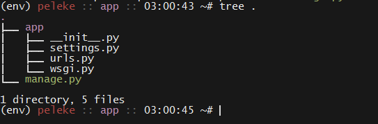

### Django & MVC

- - -

* Django is an "MVC Framework."

  * When you build a Node app with Express, you're free to choose _exactly_ how and where you save your data.

  * This freedom is powerful, but can be inconvenient, as it requires you to "glue" everything together manually.

  * Django has an opinion as to how you should architect your application, and that the architecture it imposes is called MVC.

    * Recall the model-view-controller pattern (MVC)

      * Data is stored in **models**; **views** display the data to the user; and **controllers** handle user updates to the data.

      * Within Django, a more appropriate term is MTC—or, Model; Template; Controller.

        * This is because Django's "views" have responsibilities of controllers.

_An illustration of the MVC concept._

* Django making this choice allows us to focus on _what_ our application does, rather than how the pieces fit together.

### Install Django & Create a Project

- - -

* Now that we have some background on what Django _is_, it's time to install it. 

  * First activate your virtualenv if you haven't already, and run: `pip install Django==1.10.1`.

    * Note that we don't have to use `pip3` within a virtualenv initialized against Python 3.

* Django provides a command-line tool for creating new projects, called `django-admin`.

  * Create a new project with: `django-admin startproject app`.

    * You are, of course, free to name your application whatever you'd like. We've used `app` throughout the lesson for the sake of concreteness.

_installing django._

_Starting a new project with django-admin._

* Change into the `app` directory and `ls -sl` its contents.

_The starting point for new Django applications._

_The tree view of a new Django project._

* The `app` directory contains project-wide configuration files—this is where we set up database configuration, tell Django where static files are located, etc.

* `manage.py` is where Django's utility toolchain lives.

  * This is the tool you'll use to migrate databases, run the development server, create administrators, etc.

* This directory contains all of the files for a Django _project_, but that we develop specific functionality in what Django calls _apps_.

  * Ideally, each app is responsible for a specific set of related features.

  * A web app is a collection of different "feature sets." A Django project is the web app; each "feature set" is a Django app.

* To initialize a new app, we use the `manage.py` tool.

  * Create a new app with `python manage.py startapp users`.

    * The general formula is: `python manage.py startapp $APP_NAME`.

* Display the contents of your project directory with `ls -sl`, and notice that this creates a new folder called `users`.

_Creating a new Django app._

* This directory is where we'll spend most of our development time.

* Finally, when you create a new app like this, you need to "register" it in Django's internal settings file.

  * This allows it to find important, app-specific files.

  * Open up `app/settings.py`, and scroll down to `INSTALLED_APPS`.

    * Inside the array, add: `users.apps.UsersConfig`.

    * This is a one-time setup for every new app.
