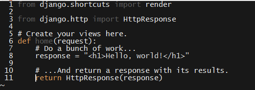

### Views and URLs

- - -

* The first thing we'll explore in the MVC pattern is the Controller layer, since this is what allows us to bind UIs to data.

* Rembember that the "controller" in MVC is called a "view" in Django.  Open up `users/views.py`.

  * The terminology isn't crucial, but we do need to remember that `views.py` is where they define controllers, not UI details.

_The default views.py._

* Each view is nothing more than a Python function.

  * When a user hits a URL/route on your website, Django calls a function defined in `views.py`.

  * Django passes the user request as a parameter to each view function, so you can, for example, determine if it was a `GET` or `POST` request.

  * You need to tell Django which function to call when a user hits a given route elsewhere. We'll get to that after defining a few view functions.

* This is easier to understand with an example:

  * First, import `HttpResponse` from `django.http`.

    * To your imports, add: `from django.http import HttpResponse`.

      * This instructs Python to import the `HttpResponse` function from the `django.http` package.

      * `HttpResponse` allows us to send a proper HTTP response to the browser, instead of just an HTML string.

  * Each view function takes `request` as its first parameter.

  * You can perform whatever logic you need inside the function body.

  * The `return` value is what Django uses to render what users see.

    * Returning HTML this way is a bit clunky...But, it will do for now.

_A simple home view._

* This tells Django what to do when users hit the home page...But, we still need to tell it what route corresponds to that home page.

* You configure this in a different file, named `urls.py`.

  * Each app can define its own URL patterns.

  * Save `views.py`, and create a file called `urls.py` in the app directory.

    * Django doesn't create this file in new apps, so you'll will need to create it yourself.

    * To configure URLs, you need to import Django's URL configuration tools.

      * Add: `from django.conf.urls import url`.

    * To map URLs to views, you need to import the views you just wrote.

      * Add: `from . import views`.

        * This tells Django to import `views.py` from this directory (`.`).

    * Django expects you to store routes in an array called `urlpatterns`. Create this array.

    * Next, define a url for the home view thus:

      * `url(r'^home', view.home, name='home')`

        * This uses the Django-provided `url` function to map the route "<http://$SITE_URL/home>" to the function `home` that we just defined in `views.py` (represented here as `view.home`).

          * The `^` metacharacter indicates start-of-line. So, any URL that starts with `home` will map to `views.index`.

          * The `r''` syntax allows us to use special characters without escape sequences.

            * In a normal string, we have to write `"\\"` to represent a single backslash. This is because the backslash on its own is used to indicate that a special character follows.

            * If we prefix a string with `r`, we don't need to double-up backslashes.

            * This exists more or less only to make regular expressions more readable. There's nothing essential about using raw string literals—you could use normal strings with double backslashes instead—but some people simply find that a bit harder to stomach.

          * This is an incorrect regular expression—it's missing the end-of-line metacharacter, `$`. This is intentional. You'll fix this shortly.

        * You can give a string name to all of our routes, which you should always do for clarity.

          * We'll see how this is useful shortly. For now, just remember it as a best practice.

    

    _Your user/urls.py configuration._

* This configures URLs for the `users` app, but that we still need to let the Django project as a whole know about these routes.

  * This is the last step for mapping URLs, and that it only needs to be done once per app.

* Navigate to `app/urls.py`, and this is where you tell Django about the routes that each of its individual apps responds to.

  * We need to include another function from the `django.conf.urls` package, called `include`.

    * `include` allows us to easily...Well, _include_ urls from one of your apps.

    * Include the urls from `users/urls.py` by adding the following call to `url` to the `urlpatterns` list:

      * `url(r'', include('users.urls')),`

    * This tells Django that, whenever a user hits the site (e.g., `localhost:8000`), it should use the URLs defined in `users/urls.py` to figure out which view to load.

* Save the file and start up a development server with `python manage.py runserver`.

  * Navigate to `localhost:8000/home/` and notice that the route works as intended.

* Now, the regular expression you used in `users/urls.py` isn't completely correct.

  * What does matching for `r'^home'` means?

    * It means to "match any string beginning with 'home'" and the program takes this literally.

    * This pattern matches _any_ string that begins with 'home'. 

      * Navigate to a few different routes to see this: `localhost:8000/home_route_we_didnt_map`, `localhost:8000/homeasdlfkja;sldfkjasdf/`, etc.

    * Stop the dev server; open up `users/urls.py`; and fix the regex by adding the `$` metacharacter.

      * This means "end-of-line". So, the updated regex means: "Match any string beginning with `home/`, _and which has nothing after._"

      * Django is helpful on this point, and "adds" the final slash for us if users forget it.

    * Start the server again, and notice that this update fixes the problem.

  * Regular expressions can be tricky because of the precision they demand, but this is one of only a few gotchas that comes up in Django development (and not as much of an issue in Django 2.1).

    

    _The corrected home route._

### Activity: Stub Views & URL Mappings  (20 Minutes)

* Take a look at the instructions in Activites/05-Views
