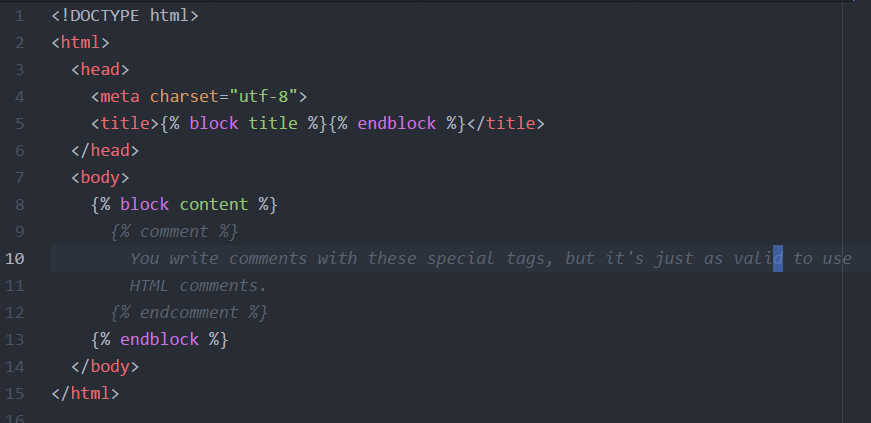

### Templates

- - -

* Just as each app can map its own urls, so too can it maintain its own templates.

* App-specific templates should be placed within the app directory, inside a folder called `templates/$APP_NAME`.

  * Move into `users`, and then create these folders with: `mkdir -p templates/users`.

  * There is a reason for the redundancy in folder names:

    * When you refer to a template by name in one of your apps, Django looks for it in _every_ app's `template` folder, and uses the first one that it finds.

    * If you meant to use, say, the `index.html` template defined in the `users` app, but Django first looks in the `templates` directory of an app called `cards`, you'll get the wrong one in your UI.

    * This is why we create a folder with the app's name inside of the `templates` directory. It creates a **namespace**, so we can refer to templates precisely: `'users/index.html'` rather than simply `'index.html'`.

* We create our templates inside of this directory, and simply refer to them by name in our views.

* Django has its own templating syntax. It's similar to Handlebars in flavor, and so shouldn't take you too long to pick up.

  * We'll learn the template system details by example. Create `templates/users/layout.html` to follow along.

* Django allows us to create **parent templates**, in which we condense markup common across templates.

  * This allows us to keep markup that appears everywhere—such as footers, navbars, etc.—in a single document, in turn allowing us to make site-wide changes by modifying a single document.

  * Django allows you to mark areas where child templates can "inject" their own content.

* Begin with a simple HTML document in `layout.html`.

  

  _Our starter HTML template._

* We don't have to do anything special to turn this into a "parent template"—all we need to do is tell child templates to use it.

  * We mark areas where child templates can inject their own content in "blocks."

  * Place a block inside of the title tag and body tags, as per the image below.

  * Child templates refer to these blocks by name to override them., we simply mark blocks off so child templates can inject their own content.

    

    _Our starter template, updated with blocks for title and body content._

* Create a template for your `home` view: `templates/users/home.html`. 

* Add an `extends` clause at the top of the document, and override the parent template `block`s.

  

  _A child template extending users/layout.html_

* Django replaces `block` statements in parents with the content in correspondingly named child templates.

  * E.g., The contents of an extending template's `...` tags will be inserted in place of the parent's ``.

* Django allows you to use a number of Python control structures by simply wrapping them in `...` tags.

  * Django offers `if/else` and `for` loops with this syntax.

    

    _If/else in Django templates._

    

    _for loops in Django templates._

* Templates won't work unless we refer to them from the view. 

* Open up `views.py`, and replace your call to `HttpResponse` with a call to `render`:

  * `render(request, 'users/home.html', {})`

  * `render` "compiles" templates by binding variables in the HTML and executing the logic of template control structures.

    * The first argument to `render` will always be the user request object.

    * The second argument is always the name of the template you want to render.

    * The last argument is a dictionary, called the **context dictionary**, which contains the variables you used in the template.

      * The _keys_ of the context dictionary need to correspond to the names of the variables you referred to in the template.

        * Recall we used the variables `name` and `tasks` in the template.

      * We're purposefully passing an empty dictionary to see how the `if`/`else` control structures works.

* Start up a dev server to see how everything works together.

  * You'll need to `makemigrations` and `migrate` before you do this. This is due to the way Django calls `render` internally.

    * Run: `python manage.py makemigrations && python manage.py migrate`.

    * This sets up the database so that Django can properly render and serve templates.

    * We'll talk more about migrations in the next section.

* Run: `python manage.py runserver`, and navigate to `localhost:8000/home`.

_Our simple template, rendered._

### Activity: Base & View Templates  (20 Minutes)

* Take a look at the instructions in Activites/06-Templates
