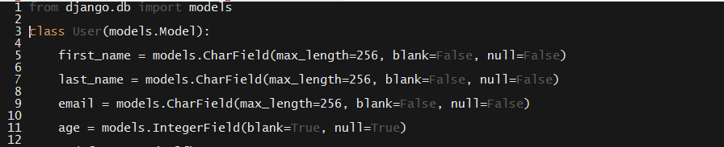
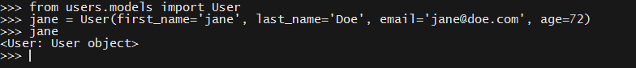
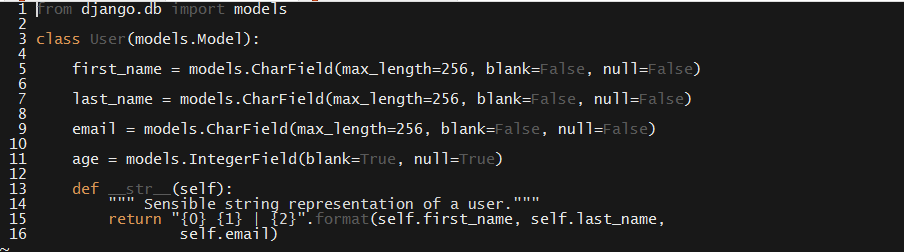
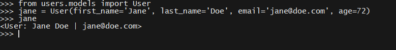
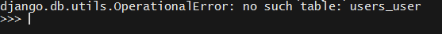
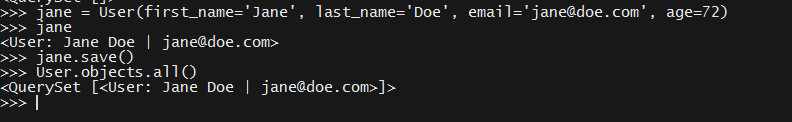

### Models & Models API

- - -

* Models and databases go hand-in-hand.

  * Models are simply Python objects that store information.

  * Django, essentially, uses models to talk to the database.

    * When a user updates or creates a record—like, say, a to-do item—Django represents it as a Python object, and then converts that object to something we can save in the database.

    * Conversely, when a user wants to retrieve information from the database, Django first converts the stored information into a Python object, which can then be used from the view.

  * Because the details of this process are complicated, Django provides an easy-to-use wrapper around it.

  * Open up `users/models.py`, and create a `User` class.

    * All Django models take `models.Model` as their Base Class.

      * This is what lets you use Django's ORM to map Python objects to the database.

    * Develop a list of attributes we might expect a user to have.

      * Include a first and last name; email address; and age, just to introduce an extra data type.

    * Creating a model with these attributes is quite straightforward.

      * The pattern is simply: `attribute_name = models.$ATTRIBUTE_TYPE(options)`.

        * Django has a _lot_ of built-in field types, available on the [documentation page](https://docs.djangoproject.com/en/1.10/ref/models/fields/#field-types). Take a look at them when the data type of your field isn't obvious, but know that only a few come up commonly.

      * The options you've passed are amongst the most common.

        * `null=False` disallows Django from storing a `null` value in the database.

        * `blank=False` disallows Django from storing an empty string as a value for the name or email attributes.

          * Note that there is a difference between storing `null` values and empty strings.  Search the web if you're curious and not clear on the difference.

      

      _Our User model._

* Django provides a special shell for us to test this out in. 

* Run: `python manage.py shell`. This drops us into a Python shell from which we can access all of Django's libraries.

* Run: `from users.models import User`.

  * Create a new user: 

    * Run: \`jane = User(first_name='Jane', last_name='Doe', email='jane@doe.com', age=72)

  * Next, print your user in the shell. Just type `jane`.

    * The default string representation—`<User: User object>`—is entirely useless.

    

    _Useless default string representation of a Python object._

* Reopen `users/models.py` and add a `__str__` method.

  * This method is what Python calls whenever it needs a string representation of an instance of the class.

  * The use of `self` is similar—but not identical—to the use of `this` in JavaScript objects.

    

    _Our User model, with a custom **str** method._

* Drop back into the Django shell, and repeat the above exercise. Notice that the `__str__` method changes the way the shell reports the value of `jane`.

  

  _Enhanced representation of the User class after addition of the **str** method._

* Next, Django models have a built-in `save` method. Try to call it on `jane`.

  * This raises an error. Call attention to the last line of the stacktrace, which reports that Django can find `no such table: user_User`.

    

    _Django throwing an error due to a nonexistent database table._

* While we created a `User` model, we did _not_ update the database to store `User` information.

* Since we used Django's ORM to define our `User` model, it's quite easy to take care of this. 

  * Recall the "migrations" command we ran in the templates section of the lesson.they ran earlier.

  * "migration" is nothing more than an script that tells Django how to update to the database.

  * Django automatically takes care of applying updates to the database—that is, _migrating_ the database—as long as we use that `migrate` command to tell it to.

* Drop out of the shell, and run `python manage.py makemigrations`. 

  * This creates the migration itself—i.e., instructions as to how to update the database to reflect the new model we created.

* Next, run: `python manage.py migrate`.

  * This actually _runs_ the migration that `makemigrations` created.

* We're _finally_ ready to create, save, and retrieve `Users`.

  * Drop into the shell and create another `jane` object.

  * Save this object to the database.

  * Finally, retrieve it using `User.objects.all()`. This returns a collection containing all user objects we've saved to the database.

    

    _Creating, saving, and retrieving an object in Django._

* These same methods are available in your views for creating, saving, and retrieving users.

  * You can access an object's properties in a template via dot notation: `{{ user.first_name }}`.

  * You'll need this information for the next activity.

- - -

#### Additional Information on OOP & Base Classes

* If you'd like to know more detail about Base Classes and subclassing, feel free to use the below information as a guide.

  * A simple analogy is that a dog is an animal. Dogs have certain traits in common with all other animals—they're multicellular, for instance.

    * In object-oriented terms, a dog `is-a`(n) animal, and _inherits_ certain characteristics of animals by virtue of being one.

      * In other words, if a dog is an animal, we at least know that it has all the attributes and performs all the basic functions expected of an animal, even if we don't know anything about dogs in particular.

      * More abstractly, if you know that a northern hairy-nosed wombat is an animal, you know at least a few things about northern hairy-nosed wombats, even if you've never seen one...Or heard of them.

  * In OOP, when a class `is-a` (super)class, it implies the class has at least the same attributes and methods as its super.

  * In this case, we could say that `Animal` is the "base class" of `NorthernHairyNosedWombat` or `Dog`.

* In Django, when we define classes whose base class is `models.Model`, it means it _inherits_ all the properties of Django's built in `models.Model` class. 

  * In particular, this means we can use all the methods that `models.Model` has available to map Python data to something we can store in the database.

* It was _much_ easier to write the `User` model than it was to run through all these details.

  * You don't need to understand all these details _right now_ in order to be effective Django developer. Just keep it in the back of your minds as you move forward—it will make sense with time and experience.

### Activity: Display Models in Index & Detail Views (35 Minutes)

* Take a look at the instructions in Activites/07-Models
